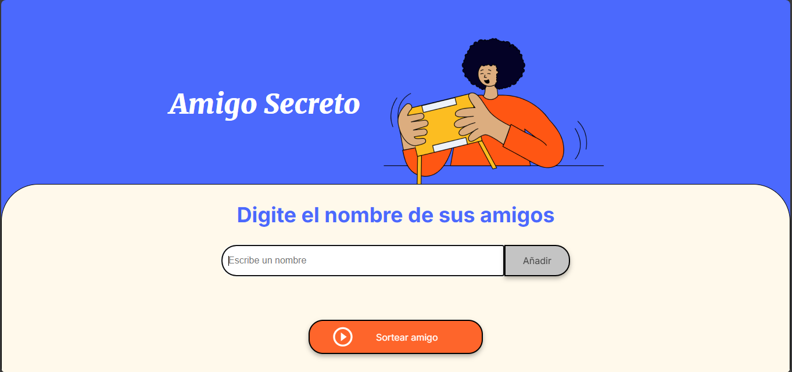

# Challenge Amigo Secreto

## Acerca de.

La aplicación consiste en permitir a los usuarios ingresar nombres de amigos en una lista para luego realizar un sorteo aleatorio y determinar quién es el **"amigo secreto"**.

El usuario deberá agregar nombres mediante un campo de texto y un botón **"Adicionar"**. Los nombres ingresados se mostrarán en una lista visible en la página, y al finalizar, un botón **"Sortear Amigo"** seleccionará uno de los nombres de forma aleatoria, mostrando el resultado en pantalla.

## Tecnologias utilizadas.
* ### HTML
* ### CSS
* ### JavaScript

## Funcionamiento.
1. **Agregar nombres**: Los usuarios escribirán el nombre de un amigo en un campo de texto y lo agregarán a una lista visible al hacer clic en "Adicionar".

2. **Validar entrada**: Si el campo de texto está vacío, el programa mostrará una alerta pidiendo un nombre válido.

3. **Visualizar la lista**: Los nombres ingresados aparecerán en una lista debajo del campo de entrada.

4. **Sorteo aleatorio**: Al hacer clic en el botón "Sortear Amigo", se seleccionará aleatoriamente un nombre de la lista y se mostrará en la página.

## Ejemplo.

La aplicacion asi como la interfaz es intuitiva y da a desmotrar lo que se tiene que hacer.

Lo primero es ingresar un uno o varios nombres de tus amigos.

Conforme vayas agregando amigos estos se agrupan en una lista de los que se estan ingresando.

Una vez ya no quieras ingresar mas amigos, al presionar el boton **"Sortear Amigo"** este mostrar quien es el amigo secreto.

## Validaciones.

Como validaciones tenemos:
* Tener texto en el input de no ser asi se muestra un mensaje.

* Contar con al menos un amigo para el sorteo.

* Deshabilitar todos los botones de la aplicacion una vez realizado el sorteo.

